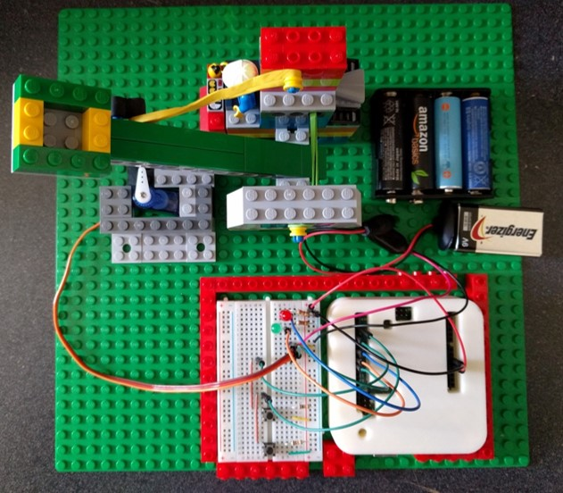

# arduino-lego-catapult
I was asked to talk at my kids' elementary school (K-5 grade) for career day.  The instructions were to create an interactive presentation that would engage the students.  The difficulty of this was coming up with something to talk about that would be interesting for students in kindergarten through fifth grade, and making something for them to play with and not just a bunch of powerpoint slides.    

I decided to make a very simple Lego Catapult and use the Arduino to control a small servo that would fire the payload.  This satisfied my goals to present a topic that was interactive, get the kids excited about engineering, electronics, and programming, and use something every kid can relate to... Legos!

## Design
My son helped build the catapult out of Legos.  The was no real plan to follow; we just started building!  We finished designing the catapult once we got the payload to fire at an acceptable distance. 

I wanted to have buttons and LEDs for the students to interact with, but wanted the design simple enough for them to understand.  

### Parts List
Here are the electrical parts we used for the project

* (1x) [Arduino Uno R3](https://www.amazon.com/Arduino-Uno-R3-Microcontroller-A000066/dp/B008GRTSV6/ref=sr_1_3?ie=UTF8&qid=1504949502&sr=8-3&keywords=arduino+uno+r3)
* (1x) [Micro Servo](https://www.amazon.com/TowerPro-SG90-Micro-Servo-2pk/dp/B01608II3Q/ref=sr_1_4?ie=UTF8&qid=1504959795&sr=8-4&keywords=small+servo)
* (2x) 220 Ohm resistors used with the LEDs
* (2x) 10k Ohm resistors used with the push button switches
* (2x) Button switches
* (1x) Green LED
* (1x) Red LED
* (4x) AA Batteries used to power the servo
* (1x) 9V Batter used to power the Arduino
* (1x) 4 AA Battery holder
* (1x) 9V Batter clip
* Jumper wires
* Legos
* Rubber band

## Finished Product
My presentation walked the kids through creating a schematic, creating a wiring diagram, following those diagrams to build a prototype, writing code to control the arduino, and finally testing your design.  

I received a lot of great feedback from the students and administration on my presentation.  They said the students all talked about after my talk.  

The students also really enjoyed it.  The older students were very interested in the Arduino and how with just a few parts you can create something.  The younger kids enjoyed like pushing the buttons and knocking over the cups.  

